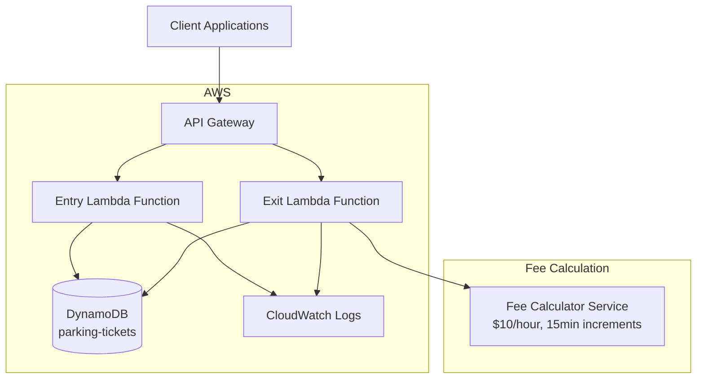

# Cloud-Based Parking Lot Management System

A serverless parking lot management system built with Python 3.12, AWS Lambda, API Gateway, and DynamoDB. Features automated fee calculation, and CI/CD pipeline.

## 🏗️ Architecture



## 🚀 Features

- **Serverless Architecture**: AWS Lambda + API Gateway for cost-effective scaling
- **RESTful API**: Two endpoints for parking entry and exit
- **Automated Fee Calculation**: $10/hour, prorated every 15 minutes
- **Production Ready**: Comprehensive error handling, logging, and monitoring
- **High Test Coverage**: with pytest
- **CI/CD Pipeline**: GitHub Actions with automated testing and deployment
- **Infrastructure as Code**: Terraform
- **Security**: Input validation, no hardcoded credentials

## 📋 API Endpoints

### POST /entry
Create a new parking entry.

**Query Parameters:**
- `plate` (string): License plate number (2-15 characters, alphanumeric)
- `parkingLot` (integer): Parking lot identifier (1-9999)

**Response:**
```json
{
  "ticketId": "a1b2c3d4-e5f6-7890-abcd-ef1234567890"
}
```

### POST /exit
Process parking exit and calculate charges.

**Query Parameters:**
- `ticketId` (string): Unique ticket identifier (UUID format)

**Response:**
```json
{
  "plate": "ABC123",
  "totalTimeMinutes": 45,
  "parkingLot": 1,
  "chargeUSD": 7.50
}
```

## 🛠️ Prerequisites

- **Python 3.12+**
- **AWS CLI** configured with credentials
- **Terraform 1.0+**
- **Git**

## 🚀 Quick Start

### 1. Clone and Setup

```bash
git clone <repository-url>
cd parking-lot-system
chmod +x scripts/*.sh
./scripts/setup-env.sh
```

### 2. Configure AWS

```bash
aws configure
# Enter your AWS Access Key ID, Secret Access Key, and region 
```

### 3. Deploy to AWS

```bash
./scripts/deploy.sh
```

### 4. Test the API

```bash
# Get your API URL from deployment output
API_URL="https://your-api-id.execute-api.eu-north-1.amazonaws.com/dev"

# Create parking entry
curl -X POST "$API_URL/entry?plate=ABC123&parkingLot=1"

# Process exit (use the ticketId from above)
curl -X POST "$API_URL/exit?ticketId=your-ticket-id"
```

## 🧪 Local Development

### Setup Development Environment

```bash
# Create virtual environment
python3.12 -m venv venv
source venv/bin/activate

# Install dependencies
pip install -r requirements-dev.txt

# Install pre-commit hooks
pre-commit install
```

### Run Tests

```bash
# Run all tests with coverage
pytest

# Run specific test file
pytest tests/test_fee_calculator.py

# Run with verbose output
pytest -v
```


## 🏗️ Infrastructure

### Terraform Resources

- **DynamoDB Table**: `parking-tickets` with pay-per-request billing
- **Lambda Functions**: Entry and exit handlers with Python 3.12 runtime
- **API Gateway**: REST API with regional endpoints
- **IAM Roles**: Least-privilege access for Lambda functions
- **CloudWatch**: Log groups with 14-day retention

### Environment Variables

```bash
# Application Configuration
PARKING_TABLE_NAME=parking-tickets
HOURLY_RATE=10.0
BILLING_INCREMENT_MINUTES=15

# AWS Configuration
AWS_REGION=eu-north-1
```

## 📊 Fee Calculation

The system uses a modular fee calculator with the following rules:

- **Base Rate**: $10.00 per hour
- **Billing Increment**: 15 minutes (rounds up)
- **Examples**:
  - 10 minutes → 15 minutes → $2.50
  - 30 minutes → 30 minutes → $5.00
  - 45 minutes → 45 minutes → $7.50
  - 50 minutes → 60 minutes → $10.00

## 🔒 Security

- **Input Validation**: All inputs validated and sanitized
- **No Hardcoded Secrets**: All credentials via environment variables
- **IAM Least Privilege**: Lambda functions have minimal required permissions
- **CORS Enabled**: Proper CORS headers for web applications
- **Error Handling**: Secure error messages without sensitive information

## 🚀 CI/CD Pipeline

The GitHub Actions pipeline includes:

1. **Testing**: Unit tests, integration tests, coverage reporting
2. **Code Quality**: Linting, formatting, security scanning
3. **Security**: Bandit security analysis
4. **Deployment**: Automated deployment to AWS on main branch
5. **Verification**: Post-deployment API testing

### Required GitHub Secrets

```bash
AWS_ACCESS_KEY_ID=your-access-key
AWS_SECRET_ACCESS_KEY=your-secret-key
```

## 📈 Monitoring and Logging

- **CloudWatch Logs**: All Lambda function logs with 14-day retention
- **Error Tracking**: Structured error logging with correlation IDs
- **Metrics**: Built-in Lambda metrics (duration, errors, throttles)
- **Alarms**: Can be configured for error rates and latency


## 🔧 Configuration

### Customizing Fee Calculation - examples

Edit `infrastructure/variables.tf`:

```hcl
variable "hourly_rate" {
  default = "15.0"  # Change to $15/hour
}

variable "billing_increment_minutes" {
  default = "30"    # Change to 30-minute increments
}
```

### Changing AWS Region

Update `.env` and `infrastructure/variables.tf`:

```bash
AWS_REGION=us-west-2
TF_VAR_aws_region=us-west-2
```
